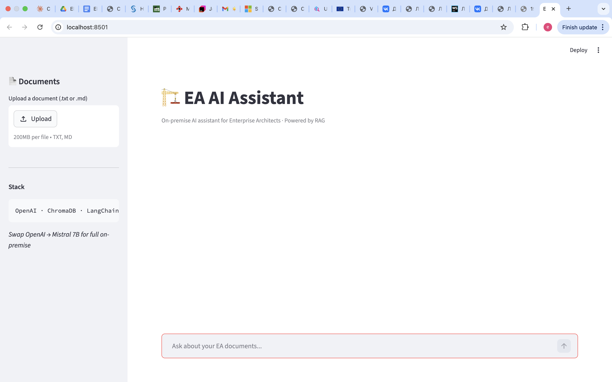
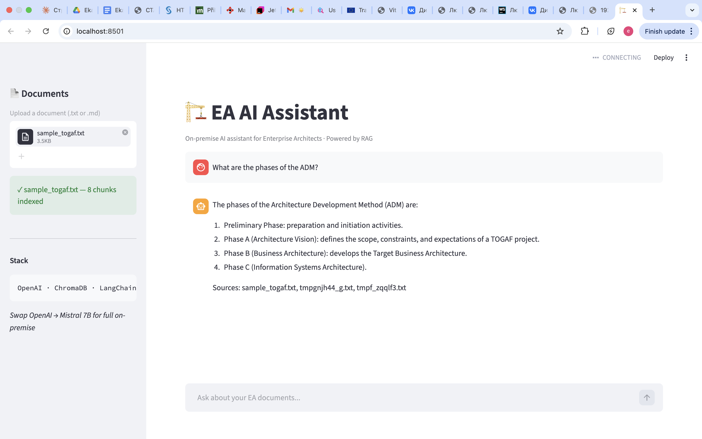

# EA AI Assistant

> On-premise AI assistant for Enterprise Architects in regulated industries.

Bachelor's thesis project @ Czech University of Life Sciences Prague (CZU) — and a real B2B MVP.

---

## Problem

Banks, insurance companies, and government institutions in the CEE region cannot use cloud AI (ChatGPT, Copilot) due to GDPR and data sovereignty requirements. Their EA teams still need AI help for documentation, gap analysis, and architectural decisions.

## Solution

A web application with a RAG pipeline that runs fully on-premise. Upload your internal EA documents — the assistant answers questions based only on them. No data leaves the company.

## Demo

## Stack

| Layer | Technology |
|---|---|
| UI | Streamlit |
| LLM | OpenAI gpt-4o-mini (dev) · Mistral 7B (on-premise) |
| Embeddings | text-embedding-3-small |
| Vector DB | ChromaDB |
| Deployment | Docker (planned) |

## Quick Start

    git clone https://github.com/Kater-code/ea-ai-assistant
    cd ea-ai-assistant
    pip install -r requirements.txt
    echo 'OPENAI_API_KEY=your_key' > .env
    streamlit run app.py

## Status

🚧 Active development — thesis defense: July 2026

Done: RAG pipeline, Streamlit UI, ChromaDB
In progress: FastAPI backend, Docker
Planned: QLoRA fine-tuning on Mistral 7B

## Author

Ekaterina Sarycheva — CZU Prague
sarychevaa.katerina@gmail.com